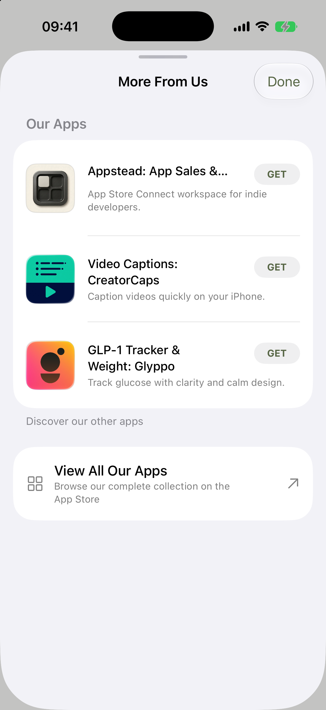
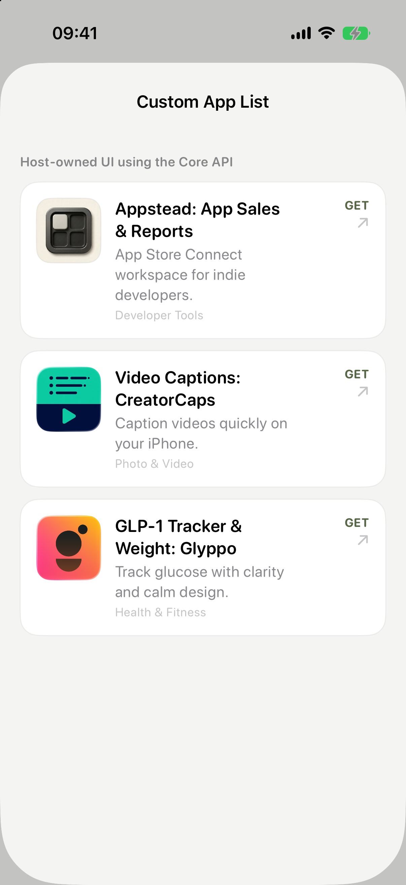

# SBAppPortfolio

[](https://github.com/slowbrewedmacchiato/SBAppPortfolio/actions/workflows/ci.yml)
[](https://swift.org)
[](https://developer.apple.com)
[](LICENSE)
[](https://slowbrewedmacchiato.github.io/SBAppPortfolio/documentation/sbappportfolio)

**A SwiftUI "More From Us" sheet for studios that ship more than one app.**

Your users already trust you. This is the screen that tells them what else you make: a settings sheet listing your other apps with their real icons, names, subtitles, and prices, pulled live from the App Store so nothing goes stale when you rename an app or change a price.

The app it runs in excludes itself. The sheet inherits your app's tint instead of imposing its own look. It ships localized and depends on nothing.

Extracted from six Slow Brewed apps that had each grown their own copy of this screen.

## What it looks like

<table>
  <tr>
    <th><code>SBAppPortfolio</code><br>Ready-made SwiftUI sheet</th>
    <th><code>SBAppPortfolioCore</code><br>The same metadata in your own UI</th>
  </tr>
  <tr>
    <td></td>
    <td></td>
  </tr>
</table>

## Choose a product

| Product | Use it when | Platforms |
| --- | --- | --- |
| `SBAppPortfolio` | You want the localized, batteries-included SwiftUI sheet, reusable row, or Store action pill. It depends on Core and preserves the original integration. | iOS 18+, macOS 13+ for the complete sheet; the action pill also supports iOS 16+, macOS 11+, and visionOS 1+ |
| `SBAppPortfolioCore` | Your app or design system owns the catalog, fallback copy, ordering, routing, and UI. Core performs a typed, batched iTunes Lookup request and returns raw metadata. | iOS 16+, macOS 11+, watchOS 9+, tvOS 16+, visionOS 1+ |

Both products add no external runtime dependencies. The Core product imports Foundation only; it does not own presentation policy or SwiftUI.

## Requirements

- iOS 18.0+ / macOS 13.0+ for the complete SwiftUI sheet (macOS only for local development and testing)
- iOS 16.0+ / macOS 11.0+ / watchOS 9.0+ / tvOS 16.0+ / visionOS 1.0+ for Core
- Swift 6.0+
- Xcode 16+

## Installation

Add the package as a dependency in Xcode (File ▸ Add Package Dependencies…) or in your `Package.swift`:

```swift
.package(url: "https://github.com/slowbrewedmacchiato/SBAppPortfolio.git", from: "1.1.0")
```

Add `SBAppPortfolio` to your target's dependencies for the packaged UI and reusable SwiftUI pieces, or add `SBAppPortfolioCore` for a Foundation-only lookup client.

## Quick start

Define your studio's apps, pass the current app's ID so it's excluded from the list, and present the sheet:

```swift
import SBAppPortfolio
import SwiftUI

struct SettingsView: View {
    @State private var showPortfolio = false

    var body: some View {
        Button("More From Us") { showPortfolio = true }
            .sheet(isPresented: $showPortfolio) {
                SBAppPortfolioView(
                    configuration: SBAppPortfolioConfiguration(
                        studioApps: [
                            SBAppReference(appID: "1234567890", fallbackName: "My First App", fallbackDescription: "A great app."),
                            SBAppReference(appID: "0987654321", fallbackName: "My Second App", fallbackDescription: "Another great app.")
                        ],
                        currentAppID: "1234567890",
                        developerPageURL: URL(string: "https://apps.apple.com/developer/id000000000")!
                    )
                )
            }
    }
}
```

The sheet fetches live metadata (icon, name, subtitle, price, genre) for every app in a single batched iTunes Lookup request, caches the results for one hour, and renders a neutral SwiftUI list. A pull-to-refresh clears the cache and re-fetches. A "View All Our Apps" footer links to your developer page.

The default `SBAppPortfolioPresentation.standard` preserves this behavior. Advanced hosts can selectively configure the sheet chrome, catalog order, summary policy, and opening behavior without replacing the original UI.

### Reusable UI pieces

`SBAppPortfolioRowView` renders a resolved `SBAppPortfolioItem` inside a host-owned composition. `SBAppPortfolioActionPill` exposes the same neutral, tint-aware GET or price capsule without taking ownership of the surrounding button:

```swift
Button(action: openApp) {
    SBAppPortfolioActionPill()
}

Button(action: buyPaidApp) {
    SBAppPortfolioActionPill(title: "$1.99")
}
```

## Features

- **Live App Store metadata** via the iTunes Lookup API (single batched request for all apps)
- **Runtime self-exclusion**: pass `currentAppID` and the host app is filtered out automatically; no per-app omission lists to maintain
- **Configurable storefront**: pass `lookupCountry` (ISO code) so users in non-US regions see localized metadata and prices
- **Locale-independent free-app detection**: uses the numeric `price` field, not the localized `formattedPrice` string, so the GET pill renders correctly in every storefront
- **Resilient decoding**: a malformed entry in the lookup response is dropped, not propagated; one bad sibling app doesn't blank the sheet
- **Bundled localization**: translations ship inside the package, so a host app gets them with no setup
- **Neutral SwiftUI**: system semantic colors and SF Symbols; apply your own theme via standard view modifiers
- **Swift Testing**: mock JSON fixtures covering parsing, configuration, cache behavior, and error mapping
- **Foundation-only Core**: build a completely custom interface without linking the packaged UI
- **Reusable presentation pieces**: compose the package row or Store action pill into a host-owned screen

## Configuration

```swift
SBAppPortfolioConfiguration(
    studioApps: [...],          // your studio catalog
    currentAppID: "your-app-id", // excluded from the displayed list
    developerPageURL: URL(...),  // your App Store developer page
    lookupCountry: "us",         // optional; default "us"
    urlSession: .shared          // optional; inject for testing
)
```

Configure only the presentation policy that your host owns:

```swift
SBAppPortfolioView(
    configuration: configuration,
    presentation: SBAppPortfolioPresentation(
        currentAppBehavior: .include,
        ordering: .catalog,
        summaryPolicy: .appStoreSubtitleThenFallback,
        showsDoneButton: false,
        showsDeveloperLink: false
    ),
    onOpenApp: { item in
        // Optional host-owned routing or analytics.
    }
)
```

### Slow Brewed catalog

If you're shipping a Slow Brewed app, use the built-in catalog and developer page URL:

```swift
SBAppPortfolioView(configuration: .slowBrewed(currentAppID: "your-app-id"))
```

## Custom UI with Core

Add only `SBAppPortfolioCore` when your app owns the catalog and presentation. Core accepts App Store IDs and returns raw metadata without deciding which apps are active, released, visible, or promoted:

```swift
import SBAppPortfolioCore

let result = try await SBAppStoreLookupService().fetchApps(
    for: SBAppLookupRequest(
        appIDs: references.map(\.appID),
        countryCode: "us",
        ordering: .caller
    )
)
```

Merge the result into your static catalog by App Store ID and retain your fallback name, description, icon, and destination when Apple omits a value. The example app includes a complete host-owned implementation; the [Getting Started guide](Docs/GettingStarted.md) documents cache, cancellation, subtitle, artwork, and result semantics.

## Storefront

By default the package queries the US storefront. Pass a different ISO country code to show users their local metadata and prices:

```swift
SBAppPortfolioConfiguration(
    studioApps: [...],
    currentAppID: "your-app-id",
    developerPageURL: URL(...),
    lookupCountry: "jp"
)
```

For automatic device-storefront detection, read `await Storefront.current?.countryCode` (StoreKit 2), or `SKPaymentQueue.default().storefront?.countryCode` on StoreKit 1, and pass the result. The package does not depend on StoreKit to keep its dependency surface minimal.

## Theming

The sheet renders in neutral SwiftUI, system semantic colors (`Color.primary`, `Color.secondary`, grouped-list backgrounds) and SF Symbols. Apply your app's theme via standard view modifiers on `SBAppPortfolioView`.

The reusable action pill also inherits the host's tint and deliberately leaves routing and button style to its caller.

## Localization

The package ships `Localizable.xcstrings`, currently covering en, de, es, fr, ja, ko, pt-BR, and zh-Hans. Strings used by the sheet resolve from the package's own bundle (`bundle: .module`), so no host-side string copying is needed.

To add a locale, extend `Localizable.xcstrings` and open a PR. CI fails the build if any key is missing a translation, or carries an empty one, in a locale the catalog declares.

## Documentation

Full integration guide: [`Docs/GettingStarted.md`](Docs/GettingStarted.md)

API reference: [SBAppPortfolio UI](https://slowbrewedmacchiato.github.io/SBAppPortfolio/documentation/sbappportfolio) and [SBAppPortfolioCore](https://slowbrewedmacchiato.github.io/SBAppPortfolio/core/documentation/sbappportfoliocore), rebuilt from source on every push to `main`.

Contributing: [CONTRIBUTING.md](CONTRIBUTING.md). Security issues: [SECURITY.md](SECURITY.md).

The published site is built and deployed by CI. To preview both documentation targets locally before opening a PR:

```bash
SBAPP_PORTFOLIO_DEVELOPMENT=1 swift package generate-documentation --target SBAppPortfolio
SBAPP_PORTFOLIO_DEVELOPMENT=1 swift package generate-documentation --target SBAppPortfolioCore
```

`swift-docc-plugin` is gated behind `SBAPP_PORTFOLIO_DEVELOPMENT` so it stays out of consumers' package graphs. Set the variable to opt in; CI sets it for the documentation job.

## License

MIT. See [`LICENSE`](LICENSE).
